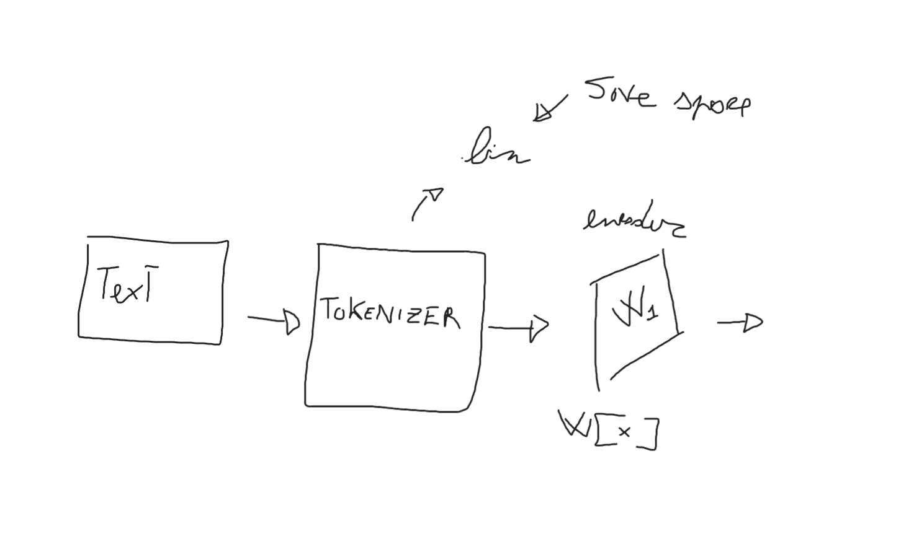

# Franco a SLM for italian 

My first slm, in honor to Francesco Damiano di Gregorio (FDDG) one of the craziest people that I know.

**\[30/03/2026\]:** 

Let's start with [nanoGPT](https://github.com/karpathy/nanoGPT/tree/master/data). It is a beautiful repository by Andrej Karpathy, so I'm going to "steal" some parts of the project. I don't want to copy its format, but it is a solid start. 

For now, my idea is to create a family of models that are specialized in Italian but with an _exotic_ attention function. 

I need to decide which datasets I am going to use.
A possible solution is using [Kenji-endo](https://apa.dipsco.unitn.it/evalita2026/36.pdf), For now I'm uncertain about the corpus that they fed into the model. 

> Btw throughout this adventure, I'm going to talk a lot about Kenji-endo, So Give it a read.

Another Idea is to use TinyStories but translated in italian ... Does it have a sense? bho... but I think, it's the faster way to create a SLM that can talk.

[piccole-storie](https://huggingface.co/datasets/markod0925/TinyStories-Italian) ok there is someone that has already done it.

**\[31/03/2026\]:** 

Today I'm going to implement the first layers. I'm studying [RoPE](https://www.youtube.com/watch?v=o29P0Kpobz0). I have the concept, now I need to think about embeddings. About the Embeddings I'm creating a structure like this:

> An important fact about normalization is that, in the original paper by vaswani et al. they use $\sqrt{d}$, but it can lead anyways to vanishing gradient, therefore RMSnorm is used. 

```python
# where norm is a RMSnorm eps 1e-6 

def forward(self, x: torch.Tensor) -> torch.Tensor:
        return self.dropout(self.norm(self.embed(x)))
```

btw I have just taken a decision. I'm going to draw what I have just done in the ugliest way possible (to have some fun).

Btw i forgot to say, that we stole the tokenizer from [Minerva](https://huggingface.co/sapienzanlp/Minerva-7B-base-v1.0).





> me stealing the tokenizer

Now, I have to do the attention mechanism, this is going to be though.

There is a lot to write there about the attention, that I wrote by mixxing stuff from claude, gemini and 3 youtube videos. I'm going to write it later.